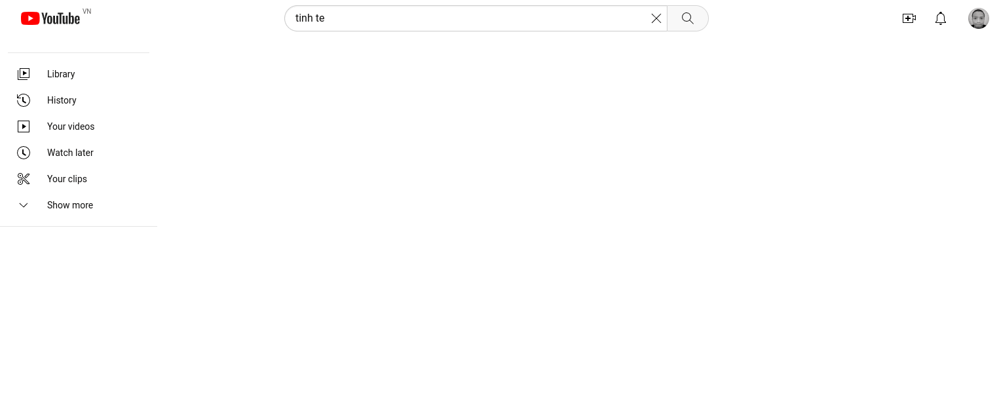
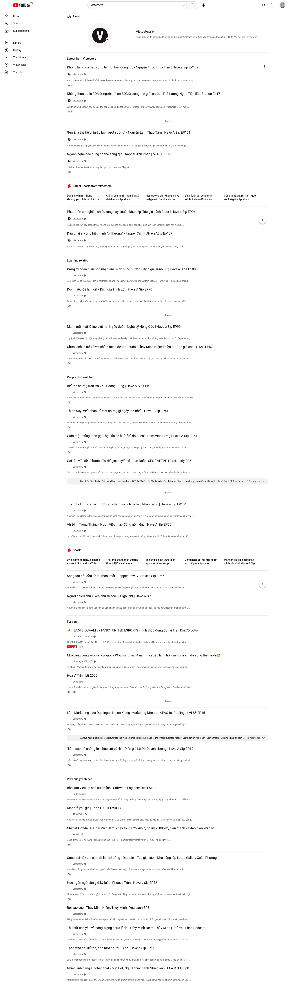

# Youtube UI zen (block all 💩)

1. dislike button: this personal chose for me, i don't want to decide dislike
2. Trending page: i don't give a 💩 the world care, i hate news, 💩 clickbait videos
3. Video views: the video have high views is good? → i don't know, So i decide to consider to other like title, thumbnail
4. Channel subscriber: i don't want to use this data to decide good/bad
5. All stuff in the top full screen video: i don't want to accident click something useless
6. Thumbnail

## Usage

- Copy paste [this file](./youtube-zen.txt) to ublock `My filters`

OR

- Add this link `https://raw.githubusercontent.com/thuanowa/youtube_zen_ublock/main/youtube-zen.txt` to your filter lists -> custom -> import box

## Preview

